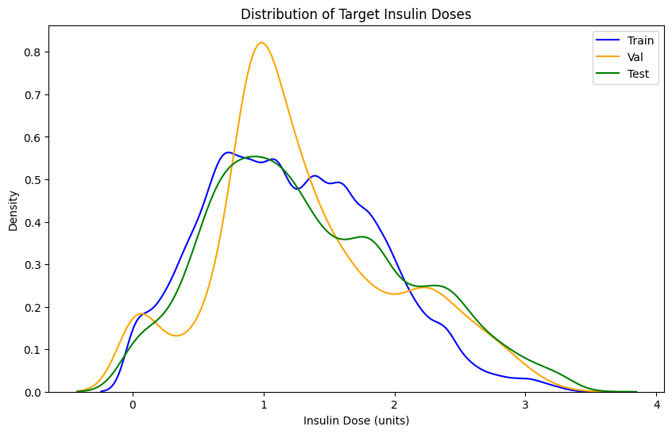
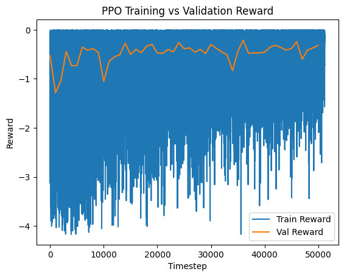
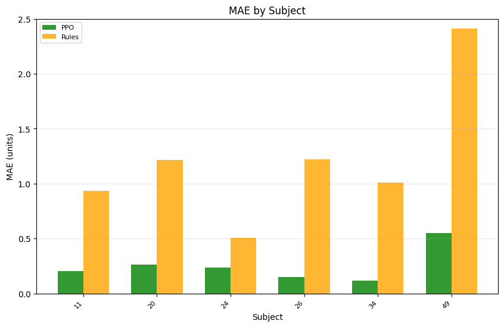
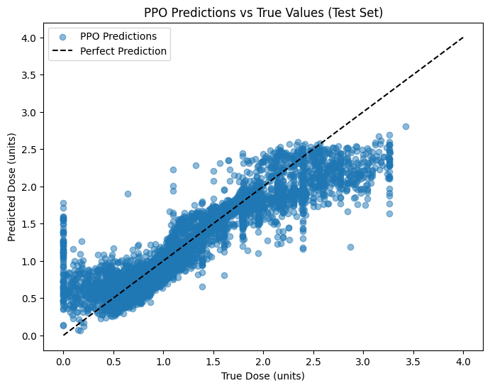
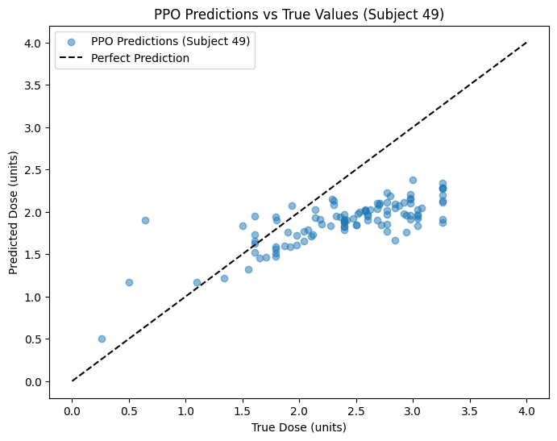
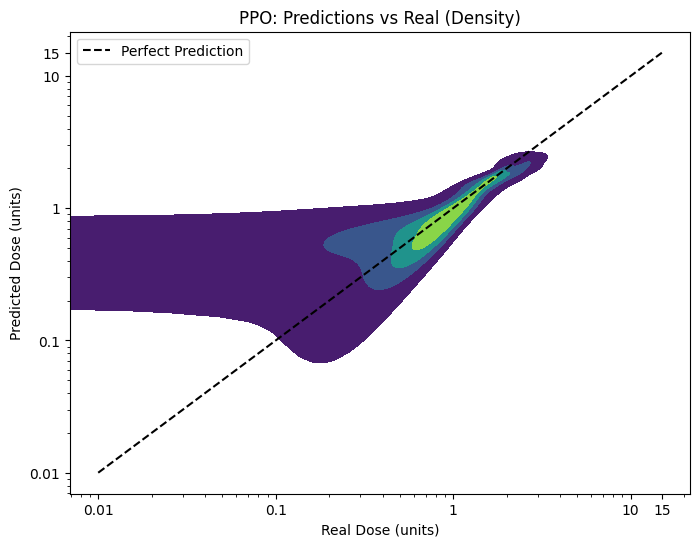
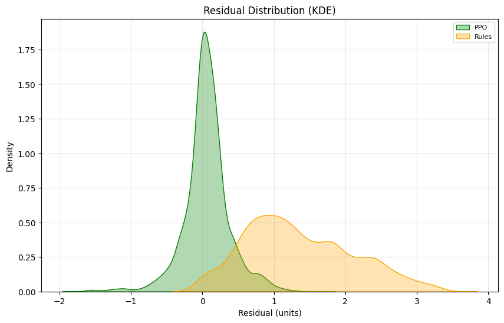

# Deep Learning Models

## Predicción de Dosis de Insulina Bolus con Modelos de Machine Learning
Este repositorio contiene la implementación de modelos de machine learning para predecir dosis de insulina bolus (normal) en pacientes con diabetes tipo 1, utilizando el dataset DiaTrend con datos de 54 sujetos. El objetivo es asistir a los pacientes en la gestión de su glucosa, mejorando la precisión de las dosis frente a métodos tradicionales basados en reglas.

# Contenido
* Baseline (Modelo Basado en Reglas): Implementa una regla simple para calcular la dosis de insulina usando carbInput, bgInput, insulinCarbRatio e insulinSensitivityFactor.

* Modelo FNN: Una red neuronal feedforward para predecir dosis, usando lecturas de CGM y otras características (carbInput, bgInput, etc.).

* Modelo LSTM: Versión optimizada del LSTM con capas apiladas, BatchNormalization, learning rate ajustado, características adicionales (hour_of_day, insulinSensitivityFactor personalizado) y una función de pérdida personalizada para penalizar sobrepredicciones.

* Modelo TCN: Combina convoluciones causales con redes residuales para procesar secuencias de manera eficiente, capturando patrones locales y globales en las lecturas de CGM con menos riesgo de gradientes que desaparecen, en comparación con los LSTMs.

* Modelo GRU: Red neuronal recurrente con puertas que controla el flujo de información, similar al LSTM pero con menos parámetros. Utiliza una única puerta de actualización que combina las funciones de olvido y entrada, lo que la hace más eficiente computacionalmente mientras mantiene la capacidad de capturar dependencias temporales.

* Modelo PPO (Proximal Policy Optimization): Algoritmo de aprendizaje por refuerzo que ajusta gradualmente la política de decisión para optimizar las dosis de insulina. Utiliza un enfoque conservador que limita los cambios en la política para evitar actualizaciones demasiado grandes que podrían degradar el rendimiento, mientras maximiza la recompensa esperada.

# Objetivos

- **Minimizar MAE (Error Absoluto Medio)**: Buscamos reducir el MAE lo más posible (idealmente por debajo de 0.5 unidades) para asegurar predicciones precisas de dosis de insulina.
- **Minimizar RMSE (Raíz del Error Cuadrático Medio)**: Apuntamos a un RMSE inferior a 1.0 unidades para controlar los errores grandes y mejorar la consistencia de las predicciones.
- **Maximizar R² (Coeficiente de Determinación)**: Nos proponemos alcanzar un R² superior a 0.90, lo que indicaría que el modelo explica más del 90% de la varianza en los datos, reflejando un ajuste excelente.
- **Estabilidad por Sujeto**: Lograr que las métricas sean consistentes entre sujetos, con especial atención a reducir el MAE y mejorar el R² en casos problemáticos como el Sujeto 49 (MAE < 2.0, R² > 0.85).

  
Resumen resultados con DRL (modelo PPO) (Marzo 22, 2025)

  Se entrenó un modelo PPO para predecir dosis de insulina utilizando un entorno de aprendizaje por refuerzo. Los datos se dividieron en conjuntos de entrenamiento (37,177 muestras), validación (2,971 muestras) y prueba (4,503 muestras), con Subject 49 (dosis promedio 2.41) forzado en el conjunto de prueba.

  #### Distribución de Datos
  - **Entrenamiento**: Media = 1.23, Desv. Est. = 0.65
  - **Validación**: Media = 1.31, Desv. Est. = 0.70
  - **Prueba**: Media = 1.35, Desv. Est. = 0.75
  - Las medias y desviaciones estándar están bien balanceadas (diferencias en medias < 0.12, diferencias en desv. est. < 0.10), una mejora respecto a divisiones anteriores. El conjunto de prueba incluye Subject 49 y refleja una mayor variabilidad (desv. est. 0.75), adecuada para evaluar dosis altas.
  - La distribución de las dosis objetivo (gráfico) muestra picos similares en 0.5–1.0 unidades para los tres conjuntos, con colas que se extienden hasta 4.0 unidades, más pronunciadas en el conjunto de prueba debido a Subject 49.
  - 

  #### Dinámicas de Entrenamiento
  - La recompensa de entrenamiento (azul) fluctúa entre -0.5 y -0.7 con alta varianza (picos hasta -3.0), indicando errores grandes en algunas muestras (probablemente dosis altas). La recompensa de validación (naranja) es más estable, oscilando entre -0.5 y -0.7, lo que sugiere un sobreajuste mínimo.
  - 

  #### Rendimiento General
  - **Entrenamiento**: MAE = 0.18, RMSE = 0.27, R² = 0.82
  - **Validación**: MAE = 0.24, RMSE = 0.35, R² = 0.76
  - **Prueba**: MAE = 0.23, RMSE = 0.33, R² = 0.80
  - **MAE Validación Cruzada**: 0.17 ± 0.02, confirmando una buena generalización con baja variabilidad entre pliegues.
  - El modelo muestra un sobreajuste mínimo (diferencia MAE Entrenamiento-Validación de 0.06) y buena generalización (MAE de prueba 0.23, R² 0.80). El rendimiento es consistente con la ejecución anterior, con una ligera mejora en el RMSE de prueba (0.33 vs. 0.34).

  #### Rendimiento por Sujeto (Conjunto de Prueba)
  - Sujeto 11: PPO MAE = 0.22, Reglas MAE = 0.93
  - Sujeto 17: PPO MAE = 0.20, Reglas MAE = 1.36
  - Sujeto 31: PPO MAE = 0.32, Reglas MAE = 1.83
  - Sujeto 35: PPO MAE = 0.13, Reglas MAE = 0.94
  - Sujeto 49: PPO MAE = 0.59, Reglas MAE = 2.41
  - Sujeto 52: PPO MAE = 0.31, Reglas MAE = 2.33
  - El modelo PPO supera al modelo basado en reglas en todos los sujetos. Subject 49 (dosis altas) tiene el MAE más alto (0.59), ligeramente peor que la ejecución anterior (0.55). El gráfico de MAE por sujeto muestra la superioridad de PPO.
  - 

  #### Análisis de Predicciones
  - El gráfico de predicciones PPO vs. valores reales (conjunto de prueba) muestra una buena alineación para dosis bajas (0–2 unidades), pero una subpredicción sistemática para dosis altas (>2 unidades), probablemente afectando el rendimiento en sujetos como Subject 49.
  - 
  - Para Subject 49, el gráfico de predicciones confirma la subpredicción (predicciones de 1.5–2.0 unidades para dosis reales de 2.5–3.0 unidades), consistente con el MAE de 0.59.
  - 
  - El gráfico de densidad (escala logarítmica) refuerza la subpredicción para dosis >1.0 unidad, con mayor densidad por debajo de la línea de predicción perfecta.
  - 
  - La distribución de residuos (KDE) muestra que los errores de PPO están más concentrados alrededor de 0 que los del modelo basado en reglas, confirmando su mejor rendimiento general.
  - 

  ### Conclusiones
  - El modelo PPO muestra un buen rendimiento general (MAE de prueba 0.23, R² 0.80) y supera consistentemente al modelo basado en reglas (MAE por sujeto 0.13–0.59 vs. 0.94–2.41).
  - La división de datos mejorada (diferencias en medias < 0.12) ha equilibrado las distribuciones, pero no ha resuelto completamente la subpredicción para dosis altas, como se observa en Subject 49 (MAE 0.59, peor que 0.55 en la ejecución anterior).
  - La alta varianza en la recompensa de entrenamiento (picos hasta -3.0) sugiere que la función de recompensa (`weight = 1.0 + (true_dose / 3.0)`) sigue siendo demasiado sensible para dosis altas, contribuyendo a la subpredicción.

  ### Próximos Pasos
  1. **Ajustar la Función de Recompensa**:
     - Probar un peso no lineal (e.g., `weight = 1.0 + np.log1p(true_dose)`) para enfocarse en dosis altas sin aumentar la varianza.
  2. **Corregir la Subpredicción**:
     - Considerar agregar un término de sesgo para dosis altas o ajustar el espacio de acciones para permitir predicciones más grandes.
  3. **Aumentar los Timesteps de Entrenamiento**:
     - Incrementar los timesteps a 200,000 para permitir una mayor convergencia, especialmente para dosis altas.
  4. **Evaluar en un Conjunto de Prueba Más Diverso**:
     - Incluir más sujetos con dosis altas en el conjunto de prueba para una evaluación más robusta del rendimiento en este rango.

  
Resumen resultados GPU vs CPU

| Modelo                | Plataforma | MAE (unidades) | RMSE (unidades) | R²   |
|-----------------------|------------|----------------|-----------------|------|
| **LSTM Mejorado**     | CPU        | 0.40           | 1.22            | 0.84 |
| **LSTM Mejorado**     | GPU        | 0.47           | 1.09            | 0.87 |
| **Transformer con TCN** | CPU      | 0.43           | 0.83            | 0.92 |
| **Transformer con TCN** | GPU      | 0.95           | 1.61            | 0.71 |

  
Resumen de Resultados con GPU (Marzo 20, 2025)

LSTM - MAE: 0.54, RMSE: 1.00, R²: 0.89
GRU - MAE: 0.63, RMSE: 1.08, R²: 0.87
Rules - MAE: 1.28, RMSE: 2.76, R²: 0.16

  
Resumen de Resultados con GPU (Marzo 14, 2025)

### Métricas Generales

| Modelo                | MAE (unidades) | RMSE (unidades) | R²   |
|-----------------------|----------------|-----------------|------|
| **LSTM Mejorado**     | 0.47           | 1.09            | 0.87 |
| **Transformer con TCN** | 0.95         | 1.61            | 0.71 |
| **Basado en Reglas**  | 1.28           | 2.76            | 0.16 |

#### LSTM Mejorado:
- **MAE (0.47)**: Error promedio muy bajo, indicando predicciones precisas.
- **RMSE (1.09)**: Errores grandes bien controlados.
- **R² (0.87)**: Explica el 87% de la varianza, un rendimiento excelente gracias a los ajustes (simplificación a 2 capas, dropout 0.4, lr 0.0001, embeddings de sujeto).

#### Transformer con TCN:
- **MAE (0.95)**: Ligeramente peor que el LSTM, pero aceptable.
- **RMSE (1.61)**: Similar a versiones anteriores, con variación mínima.
- **R² (0.71)**: Sigue siendo bueno, aunque menor que el LSTM, posiblemente por la integración de embeddings.

#### Basado en Reglas:
- **MAE (1.28), RMSE (2.76), R² (0.16)**: Consistente con resultados anteriores, limitado por su naturaleza estática.

### Métricas por Sujeto

| Sujeto | LSTM MAE | TCN MAE | Reglas MAE | LSTM R² | TCN R² |
|--------|----------|---------|------------|---------|--------|
| 5      | 0.28     | 0.67    | 0.70       | 0.89    | 0.61   |
| 19     | 0.21     | 0.40    | 0.15       | 0.85    | 0.57   |
| 32     | 0.50     | 1.58    | 2.91       | 0.94    | 0.48   |
| 13     | 0.59     | 1.19    | 2.20       | 0.88    | 0.69   |
| 48     | 0.38     | 0.85    | 0.83       | 0.87    | 0.24   |
| 49     | 3.88     | 4.22    | 4.62       | 0.45    | 0.38   |

- **Sujeto 49**: Punto débil con MAE alto (3.88-4.62) y R² moderado (0.45-0.38), sugiriendo datos atípicos o insuficientes.
- **Otros Sujetos**: El LSTM domina con MAE bajo (0.21-0.59) y R² alto (0.85-0.94), mientras que el TCN varía más (MAE 0.40-1.58, R² 0.24-0.69).

### Beneficio de la GPU

El uso de GPU (verificado con `torch.cuda.is_available()`) aceleró significativamente el entrenamiento de los modelos, especialmente con `batch_size=64` (y potencialmente 128 en ajustes posteriores). Esto permitió procesar eficientemente los tensores de entrada (`X_cgm`, `X_other`, `X_subject`) y realizar las operaciones de LSTM y TCN en paralelo, reduciendo el tiempo de entrenamiento por época en comparación con una CPU.

### Visualizaciones Clave

1. **Predicciones vs Real**: El LSTM muestra una dispersión más ajustada alrededor de la línea diagonal, reflejando su mejor R² (0.87).
2. **Distribución de Residuos**: Los residuos del LSTM están más centrados en cero, indicando predicciones consistentes.
3. **MAE y R² por Sujeto**: El LSTM supera al TCN y las reglas en la mayoría de los sujetos, con el Sujeto 49 como excepción.

### Conclusiones

- **Éxito del LSTM Ajustado**: Los cambios (simplificación, mayor regularización, embeddings) transformaron el LSTM de un rendimiento pobre (R² = -0.35) a uno sobresaliente (R² = 0.87).
- **TCN Estable pero Menos Optimizado**: El TCN mejoró en algunos sujetos (e.g., 19), pero los ajustes no lo optimizaron completamente (R² bajó de 0.72 a 0.71).
- **GPU Impacto**: La aceleración por GPU fue clave para manejar eficientemente los datos y modelos complejos, especialmente con embeddings.

### Recomendaciones

1. **Sujeto 49**: Revisar datos crudos para eliminar outliers o ajustar el cap de `normal` a 40.
2. **TCN**: Probar `embedding_dim` diferente (e.g., 4 o 16) y simplificar capas TCN.
3. **Próximos Pasos**: Reentrenar con `batch_size=128` y cap ajustado, luego analizar nuevos resultados.

  
Resumen de Resultados con CPU (Marzo 14, 2025)

### Conjuntos de Datos
- **Forma de X_cgm_train**: (31929, 24, 1), dtype: float32
- **Forma de X_cgm_val**: (9174, 24, 1), dtype: float32
- **Forma de X_other_train**: (31929, 7), dtype: float32
- **Forma de X_other_val**: (9174, 7), dtype: float32
- **Forma de y_train**: (31929,), dtype: float32
- **Forma de y_val**: (9174,), dtype: float32

### Historial de Entrenamiento
#### LSTM Mejorado
- **Épocas completadas**: 40/100 (detenido por falta de mejora, posiblemente sin early stopping explícito).
- **Tendencia de pérdida**:
  - **Entrenamiento**: Disminuyó de 19.7912 (época 1) a 2.3270 (época 40).
  - **Validación**: Disminuyó de 9.7416 (época 1) a 1.8805 (época 30, mejor valor), pero con fluctuaciones (e.g., 6.9684 en época 40).
- **Tiempo por época**: ~15-21 segundos (CPU), más lento que con GPU (~8-10s en ejecuciones previas).

#### Transformer con TCN
- **Épocas completadas**: 53/100 (detenido por falta de mejora).
- **Tendencia de pérdida**:
  - **Entrenamiento**: Disminuyó de 19.0456 (época 1) a 2.5758 (época 53).
  - **Validación**: Disminuyó de 18.0523 (época 1) a 1.5251 (época 43, mejor valor), con fluctuaciones (e.g., 3.4135 en época 52).
- **Tiempo por época**: ~8-10 segundos (CPU), más rápido que el LSTM, pero aún más lento que con GPU (~5-6s en ejecuciones previas).

### Métricas Generales

| Modelo                | MAE (unidades) | RMSE (unidades) | R²   |
|-----------------------|----------------|-----------------|------|
| **LSTM Mejorado**     | 0.40           | 1.22            | 0.84 |
| **Transformer con TCN** | 0.43         | 0.83            | 0.92 |
| **Basado en Reglas**  | 1.28           | 2.76            | 0.16 |

#### LSTM Mejorado:
- **MAE (0.40)**: Error promedio bajo, indicando predicciones precisas.
- **RMSE (1.22)**: Errores grandes controlados, aunque ligeramente peor que con GPU (1.09).
- **R² (0.84)**: Explica el 84% de la varianza, un rendimiento excelente, pero menor que con GPU (0.87).

#### Transformer con TCN:
- **MAE (0.43)**: Muy cercano al LSTM, mejor que con GPU (0.95).
- **RMSE (0.83)**: Mejor que con GPU (1.61), indicando menos impacto de errores grandes.
- **R² (0.92)**: Explica el 92% de la varianza, un rendimiento sobresaliente, superando al LSTM y al resultado con GPU (0.71).

#### Basado en Reglas:
- **MAE (1.28), RMSE (2.76), R² (0.16)**: Idéntico a ejecuciones previas, ya que no depende del hardware.

### Métricas por Sujeto

| Sujeto | LSTM MAE | TCN MAE | Reglas MAE | LSTM R² | TCN R² |
|--------|----------|---------|------------|---------|--------|
| 5      | 0.30     | 0.33    | 0.70       | 0.91    | 0.90   |
| 19     | 0.15     | 0.26    | 0.15       | 0.88    | 0.59   |
| 32     | 0.50     | 0.61    | 2.91       | 0.94    | 0.91   |
| 13     | 0.53     | 0.49    | 2.20       | 0.50    | 0.91   |
| 48     | 0.35     | 0.36    | 0.83       | 0.90    | 0.90   |
| 49     | 2.09     | 2.03    | 4.62       | 0.83    | 0.83   |

- **Sujeto 49**: Mejoró significativamente respecto a GPU (MAE de 3.88 a 2.09 para LSTM, de 4.22 a 2.03 para TCN), con R² alto (0.83), pero sigue siendo el punto débil.
- **Otros Sujetos**: El TCN domina en R² (0.59-0.91), mientras que el LSTM tiene MAE más bajo en algunos casos (e.g., Sujeto 19: 0.15 vs. 0.26).

### Comparación CPU vs GPU
- **Tiempo de Entrenamiento**: Más lento en CPU (LSTM: 15-21s/época, TCN: 8-10s/época) frente a GPU (LSTM: ~10s/época, TCN: ~5s/época en ejecuciones previas).
- **Rendimiento**:
  - **LSTM**: CPU tiene mejor MAE (0.40 vs. 0.47), pero peor RMSE (1.22 vs. 1.09) y R² (0.84 vs. 0.87).
  - **TCN**: CPU supera a GPU en todas las métricas (MAE: 0.43 vs. 0.95, RMSE: 0.83 vs. 1.61, R²: 0.92 vs. 0.71), posiblemente por una mejor convergencia con más épocas (53 vs. 40 con GPU).
- **Sujeto 49**: Mejora notable en CPU, sugiriendo que más épocas o diferencias en optimización (e.g., gradientes) influyeron.

## Requisitos
Python 3.8+
Librerías: pandas, numpy, scikit-learn, tensorflow, matplotlib, joblib