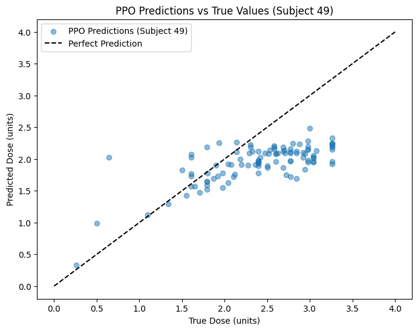

  

# Deep Learning Models

## Predicción de Dosis de Insulina Bolus con Modelos de Machine Learning
Este repositorio contiene la implementación de modelos de machine learning para predecir dosis de insulina bolus (normal) en pacientes con diabetes tipo 1, utilizando el dataset DiaTrend con datos de 54 sujetos. El objetivo es asistir a los pacientes en la gestión de su glucosa, mejorando la precisión de las dosis frente a métodos tradicionales basados en reglas.

# Contenido

  
Baseline (Modelo Basado en Reglas)

  El modelo Baseline es un enfoque tradicional que utiliza un conjunto de reglas predefinidas por expertos para calcular la dosis de insulina. En este caso, la dosis se determina mediante la siguiente fórmula:

  <pre><code>
dosis_predicha = (carbInput / insulinCarbRatio) + (bgInput - target_bg) / insulinSensitivityFactor
  </code></pre>

  Donde:
  <ul>
    <li><code>carbInput</code>: Cantidad de carbohidratos que se van a consumir.</li>
    <li><code>insulinCarbRatio</code>: Relación entre la insulina y los carbohidratos (cuánta insulina se necesita por cada gramo de carbohidrato).</li>
    <li><code>bgInput</code>: Nivel actual de glucosa en sangre.</li>
    <li><code>target_bg</code>: Nivel de glucosa objetivo (predeterminado a 100 en el código).</li>
    <li><code>insulinSensitivityFactor</code>: Factor de sensibilidad a la insulina (cuánto disminuye el nivel de glucosa una unidad de insulina).</li>
  </ul>
   
  <b>Componentes principales</b>
  <ul>
    <li><b>Entradas</b>
      <ul>
        <li><code>carbInput</code>: Cantidad de carbohidratos que se van a consumir.</li>
        <li><code>bgInput</code>: Nivel actual de glucosa en sangre.</li>
        <li><code>insulinCarbRatio</code>: Cantidad de insulina necesaria por cada gramo de carbohidrato.</li>
        <li><code>insulinSensitivityFactor</code>: Cantidad en la que una unidad de insulina reduce la glucosa en sangre.</li>
      </ul>
    </li>
    <li><b>Regla de Cálculo</b>
      
La dosis de insulina se calcula sumando la insulina necesaria para cubrir los carbohidratos y la insulina necesaria para corregir el nivel de glucosa actual al objetivo.

    </li>
  </ul>
   
  <b>Ventajas para predicción de glucosa</b>
  <ul>
    <li>Fácil de entender e implementar.</li>
    <li>No requiere datos históricos extensos para su funcionamiento inicial.</li>
    <li>Puede servir como punto de referencia para comparar el rendimiento de modelos más complejos.</li>
  </ul>
   
  <b>Consideraciones importantes</b>
  <ul>
    <li>La precisión depende en gran medida de la correcta configuración de las reglas y los parámetros individuales del paciente.</li>
    <li>Puede no adaptarse bien a la variabilidad individual y a patrones complejos en los datos de glucosa.</li>
    <li>No aprende de los datos ni mejora con el tiempo.</li>
  </ul>

  
Modelo FNN

  Un Modelo de Red Neuronal Feedforward (FNN) es un tipo de red neuronal artificial donde las conexiones entre los nodos no forman un ciclo. La información se mueve en una sola dirección, desde la capa de entrada, a través de las capas ocultas (si las hay), hasta la capa de salida. En este contexto, el FNN se utiliza para predecir la dosis de insulina basándose en las lecturas del monitor continuo de glucosa (CGM) y otras características relevantes en un momento dado.

   
  <b>Componentes principales</b>
  <ul>
    <li><b>Capa de Entrada</b>
      <ul>
        <li>Recibe las características relevantes para la predicción, como lecturas de CGM recientes, ingesta de carbohidratos, nivel de glucosa actual, etc.</li>
      </ul>
    </li>
    <li><b>Capas Ocultas</b>
      <ul>
        <li>Realizan transformaciones no lineales en los datos de entrada para aprender patrones complejos.</li>
        <li>El número de capas ocultas y el número de neuronas en cada capa son hiperparámetros que se ajustan durante el entrenamiento.</li>
      </ul>
    </li>
    <li><b>Capa de Salida</b>
      <ul>
        <li>Produce la predicción de la dosis de insulina.</li>
        <li>En este caso, la capa de salida probablemente tendrá una única neurona con una función de activación adecuada para la predicción de un valor continuo.</li>
      </ul>
    </li>
    <li><b>Funciones de Activación</b>
      <ul>
        <li>Introducen no linealidad en la red, permitiendo aprender relaciones complejas entre las características de entrada y la dosis de insulina.</li>
      </ul>
    </li>
  </ul>
   
  <b>Ejemplo simplificado en código</b>
  <pre><code>
from tensorflow.keras.models import Sequential
from tensorflow.keras.layers import Dense

# Estructura básica de un modelo FNN
model = Sequential([
    Dense(64, activation='relu', input_shape=(n_features,)),
    Dense(32, activation='relu'),
    Dense(1) # Una neurona para la predicción de la dosis
])
  </code></pre>
   
  <b>Ventajas para predicción de glucosa</b>
  <ul>
    <li>Puede aprender relaciones no lineales complejas entre las características y la dosis de insulina.</li>
    <li>Es relativamente sencillo de implementar y entrenar.</li>
    <li>Puede utilizar diversas características como entrada para mejorar la precisión de la predicción.</li>
  </ul>
   
  <b>Consideraciones importantes</b>
  <ul>
    <li>No tiene memoria inherente de secuencias temporales, por lo que puede no capturar dependencias a largo plazo en los datos de glucosa.</li>
    <li>El rendimiento depende de la calidad y la cantidad de los datos de entrenamiento.</li>
    <li>La elección de la arquitectura (número de capas y neuronas) y los hiperparámetros requiere experimentación y ajuste.</li>
  </ul>

  
Modelo TCN

  El Modelo de Red Convolucional Temporal (TCN) es una arquitectura de red neuronal diseñada específicamente para procesar datos secuenciales. A diferencia de las RNNs, las TCNs utilizan convoluciones causales, lo que significa que la predicción en un momento dado solo depende de los datos pasados y presentes, evitando la "mirada hacia el futuro". Además, las TCNs a menudo incorporan redes residuales para facilitar el entrenamiento de redes profundas y mitigar el problema de los gradientes que desaparecen.

   
  <b>Componentes principales</b>
  <ul>
    <li><b>Convoluciones Causales</b>
      <ul>
        <li>Aseguran que la salida en el tiempo <i>t</i> solo dependa de las entradas hasta el tiempo <i>t</i>.</li>
        <li>Se implementan típicamente utilizando convoluciones 1D con un desplazamiento adecuado.</li>
      </ul>
    </li>
    <li><b>Redes Residuales</b>
      <ul>
        <li>Permiten que la información fluya directamente a través de las capas, facilitando el aprendizaje de identidades y mejorando el flujo de gradientes.</li>
        <li>Un bloque residual típico consiste en una o más capas convolucionales seguidas de una conexión de salto que suma la entrada del bloque a su salida.</li>
      </ul>
    </li>
    <li><b>Dilatación</b>
      <ul>
        <li>Las convoluciones dilatadas permiten que la red tenga un campo receptivo muy grande con relativamente pocas capas.</li>
        <li>El factor de dilatación aumenta exponencialmente con la profundidad de la red, lo que permite capturar dependencias a largo plazo en la secuencia.</li>
      </ul>
    </li>
  </ul>
   
  <b>Ejemplo simplificado en código</b>
  <pre><code>
from tensorflow.keras.models import Sequential
from tensorflow.keras.layers import Conv1D, BatchNormalization, ReLU

# Bloque residual para una TCN (ejemplo simplificado)
def residual_block(x, filters, dilation_rate, kernel_size=3):
    original_x = x
    conv1 = Conv1D(filters, kernel_size, padding='causal', dilation_rate=dilation_rate)(x)
    conv1 = BatchNormalization()(conv1)
    conv1 = ReLU()(conv1)
    conv2 = Conv1D(filters, kernel_size, padding='causal', dilation_rate=dilation_rate)(conv1)
    conv2 = BatchNormalization()(conv2)
    if original_x.shape[-1] != filters:
        original_x = Conv1D(filters, 1, padding='same')(original_x)
    res = ReLU()(original_x + conv2)
    return res

# Estructura básica de un modelo TCN
def build_tcn(input_shape, num_filters=32, num_dilation_rates=2, kernel_size=3):
    inputs = tf.keras.layers.Input(shape=input_shape)
    x = inputs
    for i in range(num_dilation_rates):
        dilation_rate = 2**i
        x = residual_block(x, num_filters, dilation_rate, kernel_size)
    output = tf.keras.layers.Dense(1)(x)
    return tf.keras.models.Model(inputs=inputs, outputs=output)

# Ejemplo de uso
sequence_length = 100
n_features = 5
input_shape = (sequence_length, n_features)
model = build_tcn(input_shape)
  </code></pre>
   
  <b>Ventajas para predicción de glucosa</b>
  <ul>
    <li>Procesa secuencias de manera eficiente y en paralelo, lo que puede ser más rápido que las RNNs.</li>
    <li>Tiene un campo receptivo flexible que puede adaptarse a la longitud de las dependencias temporales en los datos de glucosa.</li>
    <li>Menos susceptible a los problemas de gradientes que desaparecen o explotan en comparación con las RNNs.</li>
    <li>Puede capturar patrones tanto locales como globales en las series temporales.</li>
  </ul>
   
  <b>Consideraciones importantes</b>
  <ul>
    <li>Puede requerir más memoria que las RNNs para campos receptivos muy grandes.</li>
    <li>La interpretación de los patrones aprendidos puede ser más compleja que en las RNNs.</li>
    <li>El diseño de la arquitectura (número de filtros, capas, tasas de dilatación) puede requerir ajuste.</li>
  </ul>

  
Modelo GRU

  La Unidad Recurrente Cerrada (GRU) es un tipo de red neuronal recurrente (RNN) que, al igual que el LSTM, está diseñada para manejar datos secuenciales y dependencias a largo plazo. Sin embargo, la GRU tiene una arquitectura más simplificada con solo dos puertas: una puerta de actualización y una puerta de reinicio. La puerta de actualización controla cuánto del estado anterior debe conservarse y cuánta nueva información debe agregarse, mientras que la puerta de reinicio determina cuánto del estado anterior debe olvidarse. Esta simplificación hace que las GRUs sean a menudo más rápidas de entrenar y tengan menos parámetros que las LSTMs, al tiempo que mantienen una capacidad similar para capturar dependencias temporales.

   
  <b>Componentes principales</b>
  <ul>
    <li><b>Puerta de Actualización</b>
      <ul>
        <li>Controla cuánto del estado oculto anterior se mantiene en el estado oculto actual.</li>
        <li>Ayuda a la red a decidir qué información del pasado debe conservarse para el futuro.</li>
      </ul>
    </li>
    <li><b>Puerta de Reinicio</b>
      <ul>
        <li>Determina cuánto del estado oculto anterior se utiliza para calcular el nuevo estado candidato.</li>
        <li>Ayuda a la red a olvidar información irrelevante del pasado.</li>
      </ul>
    </li>
    <li><b>Estado Oculto</b>
      <ul>
        <li>Almacena la información aprendida de la secuencia hasta el momento.</li>
        <li>Se actualiza en cada paso de tiempo utilizando las puertas de actualización y reinicio.</li>
      </ul>
    </li>
  </ul>
   
  <b>Ejemplo simplificado en código</b>
  <pre><code>
from tensorflow.keras.models import Sequential
from tensorflow.keras.layers import GRU, Dense, BatchNormalization

# Estructura básica de una capa GRU
model = Sequential([
    GRU(units=64,
        return_sequences=True,
        input_shape=(sequence_length, n_features)),
    BatchNormalization(),
    GRU(units=32),
    Dense(1)
])
  </code></pre>
   
  <b>Ventajas para predicción de glucosa</b>
  <ul>
    <li>Captura dependencias temporales en los datos de glucosa.</li>
    <li>Maneja secuencias de longitud variable.</li>
    <li>Tiene menos parámetros y es más eficiente computacionalmente que el LSTM.</li>
    <li>Puede lograr un rendimiento similar al LSTM en muchas tareas de modelado de secuencias.</li>
  </ul>
   
  <b>Consideraciones importantes</b>
  <ul>
    <li>Puede que no capture dependencias a muy largo plazo tan bien como el LSTM en algunos casos.</li>
    <li>Al igual que el LSTM, requiere suficientes datos de entrenamiento y es sensible a la escala de los datos.</li>
    <li>La longitud de la secuencia y el número de unidades GRU afectan el rendimiento.</li>
  </ul>

  
Modelo PPO (Proximal Policy Optimization)

  El Modelo de Optimización de Políticas Proximal (PPO) es un algoritmo de aprendizaje por refuerzo que se utiliza para entrenar agentes que toman decisiones secuenciales. En el contexto de la predicción de dosis de insulina, el agente (modelo PPO) aprende una política, que es una función que mapea el estado actual del paciente (por ejemplo, lecturas de CGM, ingesta de carbohidratos, actividad física) a una acción (la dosis de insulina a administrar). El objetivo del agente es aprender una política que maximice una recompensa acumulada a lo largo del tiempo, donde la recompensa está diseñada para reflejar el mantenimiento de los niveles de glucosa dentro de un rango saludable. PPO es un algoritmo "on-policy", lo que significa que aprende de las experiencias generadas por la política actual y actualiza la política de manera que los nuevos comportamientos no se desvíen demasiado de los antiguos, lo que ayuda a estabilizar el entrenamiento.

   
  <b>Componentes principales</b>
  <ul>
    <li><b>Agente</b>
      <ul>
        <li>El modelo que aprende a tomar decisiones (predecir la dosis de insulina).</li>
      </ul>
    </li>
    <li><b>Entorno</b>
      <ul>
        <li>La simulación del paciente y su respuesta a las dosis de insulina en función de sus datos (CGM, comidas, etc.).</li>
      </ul>
    </li>
    <li><b>Política</b>
      <ul>
        <li>La función que el agente aprende para mapear el estado del entorno a las acciones (dosis de insulina).</li>
        <li>En PPO, la política suele estar representada por una red neuronal.</li>
      </ul>
    </li>
    <li><b>Función de Valor</b>
      <ul>
        <li>Estima la recompensa futura esperada para un estado dado.</li>
        <li>Se utiliza para reducir la varianza en las estimaciones de la ventaja.</li>
      </ul>
    </li>
    <li><b>Función de Recompensa</b>
      <ul>
        <li>Define el objetivo del agente. En este caso, podría ser una función que otorga recompensas por mantener los niveles de glucosa dentro de un rango objetivo y penaliza las desviaciones.</li>
      </ul>
    </li>
    <li><b>Optimización Proximal</b>
      <ul>
        <li>El mecanismo clave de PPO que limita la magnitud del cambio en la política durante cada actualización para evitar grandes caídas en el rendimiento.</li>
        <li>Utiliza una función objetivo recortada para asegurar que la nueva política no sea demasiado diferente de la política anterior.</li>
      </ul>
    </li>
  </ul>
   
  <b>Ejemplo simplificado en código (Conceptual)</b>
  <pre><code>
import tensorflow as tf
import numpy as np

class ActorCritic(tf.keras.Model):
    def __init__(self, num_actions):
        super(ActorCritic, self).__init__()
        self.common = tf.keras.layers.Dense(64, activation='relu')
        self.actor = tf.keras.layers.Dense(num_actions, activation='softmax')
        self.critic = tf.keras.layers.Dense(1)

    def call(self, inputs):
        x = self.common(inputs)
        return self.actor(x), self.critic(x)

# Ejemplo de entrenamiento (muy simplificado y conceptual)
def train_ppo(env, model, optimizer, epochs):
    for epoch in range(epochs):
        state = env.reset()
        for t in range(max_steps):
            action_probs, value = model(np.array([state]))
            action = np.random.choice(num_actions, p=action_probs.numpy()[0])
            next_state, reward, done, _ = env.step(action)
            # ... (cálculo de la ventaja, actualización de la política y la función de valor usando el optimizador) ...
            state = next_state
            if done:
                break
  </code></pre>
   
  <b>Ventajas para predicción de glucosa</b>
  <ul>
    <li>Puede aprender políticas óptimas para la administración de insulina a largo plazo, considerando las consecuencias futuras de las decisiones actuales.</li>
    <li>Se adapta a la dinámica compleja y a la variabilidad individual de los pacientes.</li>
    <li>Puede incorporar múltiples factores y objetivos en la función de recompensa (por ejemplo, mantener la glucosa en rango, minimizar la hipoglucemia y la hiperglucemia).</li>
  </ul>
   
  <b>Consideraciones importantes</b>
  <ul>
    <li>El entrenamiento de modelos de aprendizaje por refuerzo puede ser complejo y requerir una gran cantidad de datos y simulación del entorno.</li>
    <li>La definición de la función de recompensa es crucial y puede afectar significativamente el comportamiento del agente.</li>
    <li>La interpretabilidad de la política aprendida puede ser un desafío.</li>
    <li>La estabilidad del entrenamiento puede ser un problema, y se requieren técnicas como la optimización proximal para mejorarla.</li>
  </ul>

# Objetivos

  
Minimizar MAE (Error Absoluto Medio)

  Buscamos reducir el MAE lo más posible (idealmente por debajo de 0.5 unidades) para asegurar predicciones precisas de dosis de insulina.
   
  El Error Absoluto Medio (MAE) mide la magnitud promedio de los errores en un conjunto de predicciones, sin considerar su dirección. Se calcula como la media de las diferencias absolutas entre cada valor predicho y el valor real. Un MAE más bajo indica una mayor precisión del modelo.
   
  Fórmula:
  <pre><code>
MAE = (1/n) * Σ |yᵢ - ŷᵢ|
  </code></pre>
  Donde:
  <ul>
    <li>n es el número de predicciones</li>
    <li>yᵢ es el valor real</li>
    <li>ŷᵢ es el valor predicho</li>
  </ul>

  
Minimizar RMSE (Raíz del Error Cuadrático Medio)

  Apuntamos a un RMSE inferior a 1.0 unidades para controlar los errores grandes y mejorar la consistencia de las predicciones.
   
  La Raíz del Error Cuadrático Medio (RMSE) mide la desviación estándar de los errores de predicción. A diferencia del MAE, el RMSE penaliza los errores más grandes de manera más significativa debido al término cuadrático. Por lo tanto, un RMSE más bajo indica que el modelo tiene errores más pequeños en general y es más consistente en sus predicciones.
   
  Fórmula:
  <pre><code>
RMSE = √[(1/n) * Σ (yᵢ - ŷᵢ)²]
  </code></pre>
  Donde:
  <ul>
    <li>n es el número de predicciones</li>
    <li>yᵢ es el valor real</li>
    <li>ŷᵢ es el valor predicho</li>
  </ul>

  
Maximizar R² (Coeficiente de Determinación)

  Nos proponemos alcanzar un R² superior a 0.90, lo que indicaría que el modelo explica más del 90% de la varianza en los datos, reflejando un ajuste excelente.
   
  El Coeficiente de Determinación (R²) representa la proporción de la varianza en la variable dependiente que es predecible a partir de las variables independientes. En otras palabras, indica qué tan bien se ajusta el modelo a los datos observados. Un valor de R² cercano a 1 indica un buen ajuste, mientras que un valor cercano a 0 sugiere que el modelo no explica mucha de la variabilidad en los datos.
   
  Fórmula:
  <pre><code>
R² = 1 - [Σ (yᵢ - ŷᵢ)² / Σ (yᵢ - <0xC8><0xB3>)²]
  </code></pre>
  Donde:
  <ul>
    <li>yᵢ es el valor real</li>
    <li>ŷᵢ es el valor predicho</li>
    <li><0xC8><0xB3> es la media de los valores reales</li>
  </ul>

  
Estabilidad por Sujeto

  Lograr que las métricas sean consistentes entre sujetos, con especial atención a reducir el MAE y mejorar el R² en casos problemáticos como el Sujeto 49 (MAE < 2.0, R² > 0.85).
  

# Resultados

  
Resumen resultados con DRL (modelo PPO) (Marzo 21, 2025)

  Se entrenó un modelo PPO para predecir dosis de insulina utilizando un entorno de aprendizaje por refuerzo. Los datos se dividieron en conjuntos de entrenamiento (37,177 muestras), validación (2,971 muestras) y prueba (4,503 muestras), con Subject 49 (dosis promedio 2.41) forzado en el conjunto de prueba.

  #### Distribución de Datos
  - **Entrenamiento**: Media = 1.23, Desv. Est. = 0.65
  - **Validación**: Media = 1.31, Desv. Est. = 0.70
  - **Prueba**: Media = 1.35, Desv. Est. = 0.75
  - Las medias y desviaciones estándar están bien balanceadas (diferencias en medias < 0.12, diferencias en desv. est. < 0.10), una mejora respecto a divisiones anteriores. El conjunto de prueba incluye Subject 49 y refleja una mayor variabilidad (desv. est. 0.75), adecuada para evaluar dosis altas.
  - La distribución de las dosis objetivo (gráfico) muestra picos similares en 0.5–1.0 unidades para los tres conjuntos, con colas que se extienden hasta 4.0 unidades, más pronunciadas en el conjunto de prueba debido a Subject 49.
  - 

  #### Dinámicas de Entrenamiento
  - La recompensa de entrenamiento (azul) fluctúa entre -0.5 y -0.7 con alta varianza (picos hasta -3.0), indicando errores grandes en algunas muestras (probablemente dosis altas). La recompensa de validación (naranja) es más estable, oscilando entre -0.5 y -0.7, lo que sugiere un sobreajuste mínimo.
  - 

  #### Rendimiento General
  - **Entrenamiento**: MAE = 0.18, RMSE = 0.27, R² = 0.82
  - **Validación**: MAE = 0.24, RMSE = 0.35, R² = 0.76
  - **Prueba**: MAE = 0.23, RMSE = 0.33, R² = 0.80
  - **MAE Validación Cruzada**: 0.17 ± 0.02, confirmando una buena generalización con baja variabilidad entre pliegues.
  - El modelo muestra un sobreajuste mínimo (diferencia MAE Entrenamiento-Validación de 0.06) y buena generalización (MAE de prueba 0.23, R² 0.80). El rendimiento es consistente con la ejecución anterior, con una ligera mejora en el RMSE de prueba (0.33 vs. 0.34).

  #### Rendimiento por Sujeto (Conjunto de Prueba)
  - Sujeto 11: PPO MAE = 0.22, Reglas MAE = 0.93
  - Sujeto 17: PPO MAE = 0.20, Reglas MAE = 1.36
  - Sujeto 31: PPO MAE = 0.32, Reglas MAE = 1.83
  - Sujeto 35: PPO MAE = 0.13, Reglas MAE = 0.94
  - Sujeto 49: PPO MAE = 0.59, Reglas MAE = 2.41
  - Sujeto 52: PPO MAE = 0.31, Reglas MAE = 2.33
  - El modelo PPO supera al modelo basado en reglas en todos los sujetos. Subject 49 (dosis altas) tiene el MAE más alto (0.59), ligeramente peor que la ejecución anterior (0.55). El gráfico de MAE por sujeto muestra la superioridad de PPO.
  - 

  #### Análisis de Predicciones
  - El gráfico de predicciones PPO vs. valores reales (conjunto de prueba) muestra una buena alineación para dosis bajas (0–2 unidades), pero una subpredicción sistemática para dosis altas (>2 unidades), probablemente afectando el rendimiento en sujetos como Subject 49.
  - 
  - Para Subject 49, el gráfico de predicciones confirma la subpredicción (predicciones de 1.5–2.0 unidades para dosis reales de 2.5–3.0 unidades), consistente con el MAE de 0.59.
  - 
  - El gráfico de densidad (escala logarítmica) refuerza la subpredicción para dosis >1.0 unidad, con mayor densidad por debajo de la línea de predicción perfecta.
  - 
  - La distribución de residuos (KDE) muestra que los errores de PPO están más concentrados alrededor de 0 que los del modelo basado en reglas, confirmando su mejor rendimiento general.
  - 

  ### Conclusiones
  - El modelo PPO muestra un buen rendimiento general (MAE de prueba 0.23, R² 0.80) y supera consistentemente al modelo basado en reglas (MAE por sujeto 0.13–0.59 vs. 0.94–2.41).
  - La división de datos mejorada (diferencias en medias < 0.12) ha equilibrado las distribuciones, pero no ha resuelto completamente la subpredicción para dosis altas, como se observa en Subject 49 (MAE 0.59, peor que 0.55 en la ejecución anterior).
  - La alta varianza en la recompensa de entrenamiento (picos hasta -3.0) sugiere que la función de recompensa (`weight = 1.0 + (true_dose / 3.0)`) sigue siendo demasiado sensible para dosis altas, contribuyendo a la subpredicción.

  ### Próximos Pasos
  1. **Ajustar la Función de Recompensa**:
     - Probar un peso no lineal (e.g., `weight = 1.0 + np.log1p(true_dose)`) para enfocarse en dosis altas sin aumentar la varianza.
  2. **Corregir la Subpredicción**:
     - Considerar agregar un término de sesgo para dosis altas o ajustar el espacio de acciones para permitir predicciones más grandes.
  3. **Aumentar los Timesteps de Entrenamiento**:
     - Incrementar los timesteps a 200,000 para permitir una mayor convergencia, especialmente para dosis altas.
  4. **Evaluar en un Conjunto de Prueba Más Diverso**:
     - Incluir más sujetos con dosis altas en el conjunto de prueba para una evaluación más robusta del rendimiento en este rango.

  
Resumen resultados GPU vs CPU

| Modelo                | Plataforma | MAE (unidades) | RMSE (unidades) | R²   |
|-----------------------|------------|----------------|-----------------|------|
| **LSTM Mejorado**     | CPU        | 0.40           | 1.22            | 0.84 |
| **LSTM Mejorado**     | GPU        | 0.47           | 1.09            | 0.87 |
| **Transformer con TCN** | CPU      | 0.43           | 0.83            | 0.92 |
| **Transformer con TCN** | GPU      | 0.95           | 1.61            | 0.71 |

  
Resumen de Resultados con GPU (Marzo 20, 2025)

LSTM - MAE: 0.54, RMSE: 1.00, R²: 0.89
GRU - MAE: 0.63, RMSE: 1.08, R²: 0.87
Rules - MAE: 1.28, RMSE: 2.76, R²: 0.16

  
Resumen de Resultados con GPU (Marzo 14, 2025)

### Métricas Generales

| Modelo                | MAE (unidades) | RMSE (unidades) | R²   |
|-----------------------|----------------|-----------------|------|
| **LSTM Mejorado**     | 0.47           | 1.09            | 0.87 |
| **Transformer con TCN** | 0.95         | 1.61            | 0.71 |
| **Basado en Reglas**  | 1.28           | 2.76            | 0.16 |

#### LSTM Mejorado:
- **MAE (0.47)**: Error promedio muy bajo, indicando predicciones precisas.
- **RMSE (1.09)**: Errores grandes bien controlados.
- **R² (0.87)**: Explica el 87% de la varianza, un rendimiento excelente gracias a los ajustes (simplificación a 2 capas, dropout 0.4, lr 0.0001, embeddings de sujeto).

#### Transformer con TCN:
- **MAE (0.95)**: Ligeramente peor que el LSTM, pero aceptable.
- **RMSE (1.61)**: Similar a versiones anteriores, con variación mínima.
- **R² (0.71)**: Sigue siendo bueno, aunque menor que el LSTM, posiblemente por la integración de embeddings.

#### Basado en Reglas:
- **MAE (1.28), RMSE (2.76), R² (0.16)**: Consistente con resultados anteriores, limitado por su naturaleza estática.

### Métricas por Sujeto

| Sujeto | LSTM MAE | TCN MAE | Reglas MAE | LSTM R² | TCN R² |
|--------|----------|---------|------------|---------|--------|
| 5      | 0.28     | 0.67    | 0.70       | 0.89    | 0.61   |
| 19     | 0.21     | 0.40    | 0.15       | 0.85    | 0.57   |
| 32     | 0.50     | 1.58    | 2.91       | 0.94    | 0.48   |
| 13     | 0.59     | 1.19    | 2.20       | 0.88    | 0.69   |
| 48     | 0.38     | 0.85    | 0.83       | 0.87    | 0.24   |
| 49     | 3.88     | 4.22    | 4.62       | 0.45    | 0.38   |

- **Sujeto 49**: Punto débil con MAE alto (3.88-4.62) y R² moderado (0.45-0.38), sugiriendo datos atípicos o insuficientes.
- **Otros Sujetos**: El LSTM domina con MAE bajo (0.21-0.59) y R² alto (0.85-0.94), mientras que el TCN varía más (MAE 0.40-1.58, R² 0.24-0.69).

### Beneficio de la GPU

El uso de GPU (verificado con `torch.cuda.is_available()`) aceleró significativamente el entrenamiento de los modelos, especialmente con `batch_size=64` (y potencialmente 128 en ajustes posteriores). Esto permitió procesar eficientemente los tensores de entrada (`X_cgm`, `X_other`, `X_subject`) y realizar las operaciones de LSTM y TCN en paralelo, reduciendo el tiempo de entrenamiento por época en comparación con una CPU.

### Visualizaciones Clave

1. **Predicciones vs Real**: El LSTM muestra una dispersión más ajustada alrededor de la línea diagonal, reflejando su mejor R² (0.87).
2. **Distribución de Residuos**: Los residuos del LSTM están más centrados en cero, indicando predicciones consistentes.
3. **MAE y R² por Sujeto**: El LSTM supera al TCN y las reglas en la mayoría de los sujetos, con el Sujeto 49 como excepción.

### Conclusiones

- **Éxito del LSTM Ajustado**: Los cambios (simplificación, mayor regularización, embeddings) transformaron el LSTM de un rendimiento pobre (R² = -0.35) a uno sobresaliente (R² = 0.87).
- **TCN Estable pero Menos Optimizado**: El TCN mejoró en algunos sujetos (e.g., 19), pero los ajustes no lo optimizaron completamente (R² bajó de 0.72 a 0.71).
- **GPU Impacto**: La aceleración por GPU fue clave para manejar eficientemente los datos y modelos complejos, especialmente con embeddings.

### Recomendaciones

1. **Sujeto 49**: Revisar datos crudos para eliminar outliers o ajustar el cap de `normal` a 40.
2. **TCN**: Probar `embedding_dim` diferente (e.g., 4 o 16) y simplificar capas TCN.
3. **Próximos Pasos**: Reentrenar con `batch_size=128` y cap ajustado, luego analizar nuevos resultados.

  
Resumen de Resultados con CPU (Marzo 14, 2025)

### Conjuntos de Datos
- **Forma de X_cgm_train**: (31929, 24, 1), dtype: float32
- **Forma de X_cgm_val**: (9174, 24, 1), dtype: float32
- **Forma de X_other_train**: (31929, 7), dtype: float32
- **Forma de X_other_val**: (9174, 7), dtype: float32
- **Forma de y_train**: (31929,), dtype: float32
- **Forma de y_val**: (9174,), dtype: float32

### Historial de Entrenamiento
#### LSTM Mejorado
- **Épocas completadas**: 40/100 (detenido por falta de mejora, posiblemente sin early stopping explícito).
- **Tendencia de pérdida**:
  - **Entrenamiento**: Disminuyó de 19.7912 (época 1) a 2.3270 (época 40).
  - **Validación**: Disminuyó de 9.7416 (época 1) a 1.8805 (época 30, mejor valor), pero con fluctuaciones (e.g., 6.9684 en época 40).
- **Tiempo por época**: ~15-21 segundos (CPU), más lento que con GPU (~8-10s en ejecuciones previas).

#### Transformer con TCN
- **Épocas completadas**: 53/100 (detenido por falta de mejora).
- **Tendencia de pérdida**:
  - **Entrenamiento**: Disminuyó de 19.0456 (época 1) a 2.5758 (época 53).
  - **Validación**: Disminuyó de 18.0523 (época 1) a 1.5251 (época 43, mejor valor), con fluctuaciones (e.g., 3.4135 en época 52).
- **Tiempo por época**: ~8-10 segundos (CPU), más rápido que el LSTM, pero aún más lento que con GPU (~5-6s en ejecuciones previas).

### Métricas Generales

| Modelo                | MAE (unidades) | RMSE (unidades) | R²   |
|-----------------------|----------------|-----------------|------|
| **LSTM Mejorado**     | 0.40           | 1.22            | 0.84 |
| **Transformer con TCN** | 0.43         | 0.83            | 0.92 |
| **Basado en Reglas**  | 1.28           | 2.76            | 0.16 |

#### LSTM Mejorado:
- **MAE (0.40)**: Error promedio bajo, indicando predicciones precisas.
- **RMSE (1.22)**: Errores grandes controlados, aunque ligeramente peor que con GPU (1.09).
- **R² (0.84)**: Explica el 84% de la varianza, un rendimiento excelente, pero menor que con GPU (0.87).

#### Transformer con TCN:
- **MAE (0.43)**: Muy cercano al LSTM, mejor que con GPU (0.95).
- **RMSE (0.83)**: Mejor que con GPU (1.61), indicando menos impacto de errores grandes.
- **R² (0.92)**: Explica el 92% de la varianza, un rendimiento sobresaliente, superando al LSTM y al resultado con GPU (0.71).

#### Basado en Reglas:
- **MAE (1.28), RMSE (2.76), R² (0.16)**: Idéntico a ejecuciones previas, ya que no depende del hardware.

### Métricas por Sujeto

| Sujeto | LSTM MAE | TCN MAE | Reglas MAE | LSTM R² | TCN R² |
|--------|----------|---------|------------|---------|--------|
| 5      | 0.30     | 0.33    | 0.70       | 0.91    | 0.90   |
| 19     | 0.15     | 0.26    | 0.15       | 0.88    | 0.59   |
| 32     | 0.50     | 0.61    | 2.91       | 0.94    | 0.91   |
| 13     | 0.53     | 0.49    | 2.20       | 0.50    | 0.91   |
| 48     | 0.35     | 0.36    | 0.83       | 0.90    | 0.90   |
| 49     | 2.09     | 2.03    | 4.62       | 0.83    | 0.83   |

- **Sujeto 49**: Mejoró significativamente respecto a GPU (MAE de 3.88 a 2.09 para LSTM, de 4.22 a 2.03 para TCN), con R² alto (0.83), pero sigue siendo el punto débil.
- **Otros Sujetos**: El TCN domina en R² (0.59-0.91), mientras que el LSTM tiene MAE más bajo en algunos casos (e.g., Sujeto 19: 0.15 vs. 0.26).

### Comparación CPU vs GPU
- **Tiempo de Entrenamiento**: Más lento en CPU (LSTM: 15-21s/época, TCN: 8-10s/época) frente a GPU (LSTM: ~10s/época, TCN: ~5s/época en ejecuciones previas).
- **Rendimiento**:
  - **LSTM**: CPU tiene mejor MAE (0.40 vs. 0.47), pero peor RMSE (1.22 vs. 1.09) y R² (0.84 vs. 0.87).
  - **TCN**: CPU supera a GPU en todas las métricas (MAE: 0.43 vs. 0.95, RMSE: 0.83 vs. 1.61, R²: 0.92 vs. 0.71), posiblemente por una mejor convergencia con más épocas (53 vs. 40 con GPU).
- **Sujeto 49**: Mejora notable en CPU, sugiriendo que más épocas o diferencias en optimización (e.g., gradientes) influyeron.

## Requisitos
Python 3.8+
Librerías: pandas, numpy, scikit-learn, tensorflow, matplotlib, joblib, polars, jax, gymnasium, stable_baselines3
